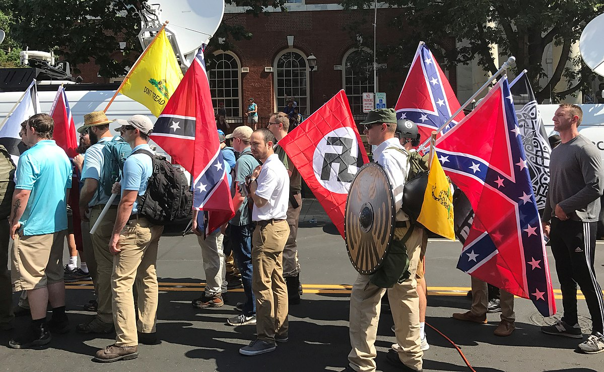
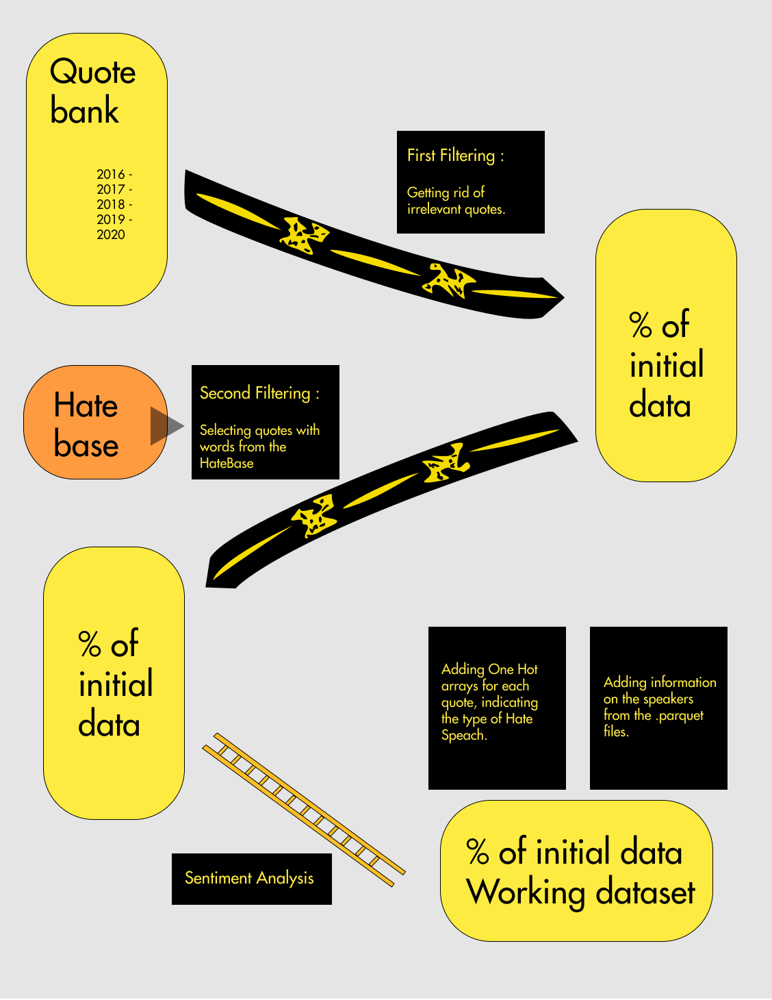
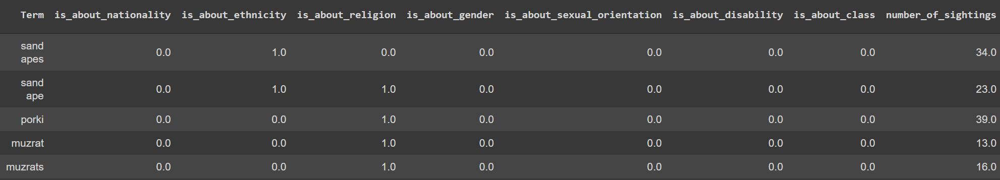
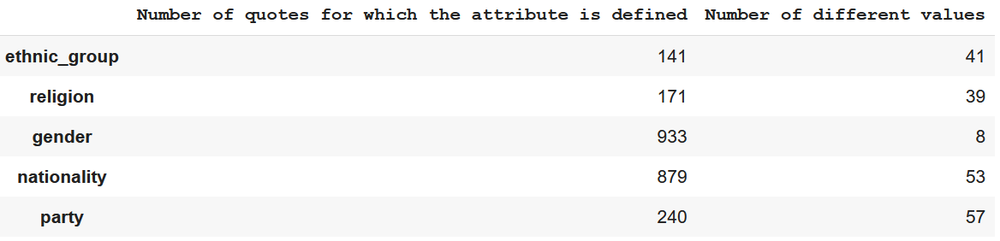
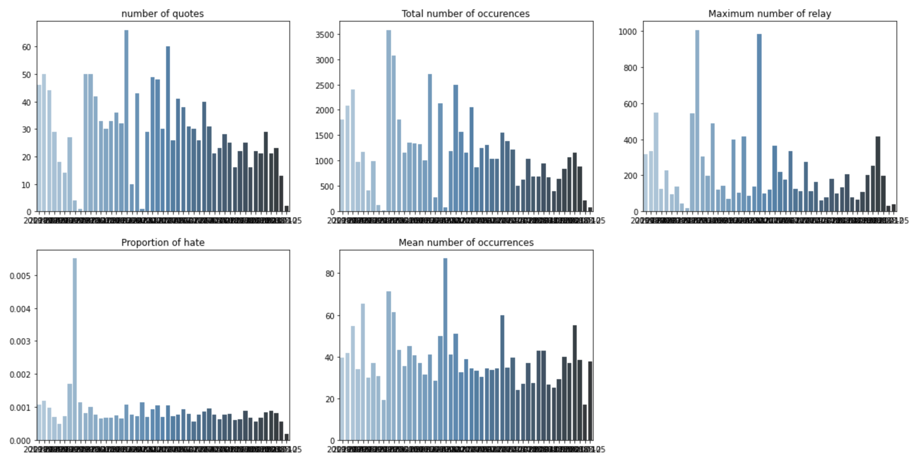
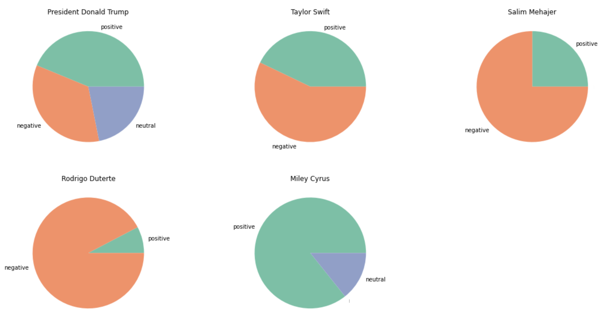
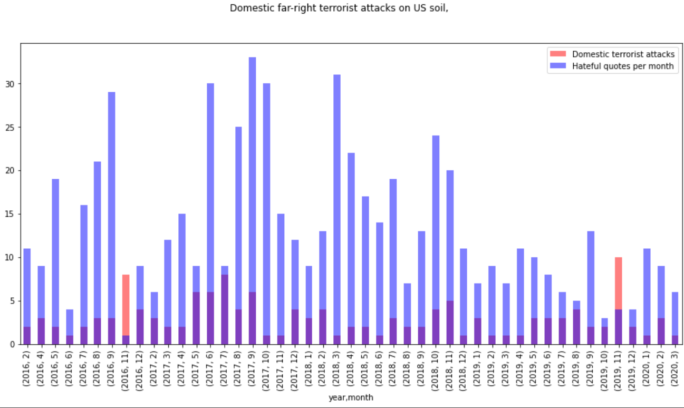

# This project is the work of :
## **Nathan Girard**, **Clémentine Lévy-Fidel**, **Camil Hamdane**, **Nathan Fiorellino**

<!-- TABLE OF CONTENTS -->
## Table of Contents

* [We start with Data and Questions !?](#We-start-with-Data-and-Questions-!?)
  * [Research questions and hypothesis](#Research-questions-and-hypothesis)
  * [Data](#Data)
   * [Quotebank](#Quotebank)
   * [Hatebase](#Hatebase)
   * [CSIS database (Washington Post subset)](#CSIS-database-(Washington-Post-subset))
* [We throw the data around](#We-throw-the-data-around)
  * [First Filtering](#First-Filtering)
  * [Second Filtering](#Second-Filtering)
  * [Who are the speakers?](#Speakers)
  * [Sentiment Analysis](#Sentiment-Analysis)
* [We stare at the data until it reveals all its secrets](#We_stare_at_the_data_until_it_reveals_all_its_secrets)
  * [Chapter 1 : Attributes of speakers associated to hateful quotes](#Chapter_1_:_Attributes_of_speakers_associated_to_hateful_quotes)
  * [Chapter 2 : Hate speech is on the rise since 2016 ](#Chapter_2_:_Hate_speech_is_on the_rise_since_2016)
  * [Chapter 3 : Correlation between major events and variation in Hate speech relay](#Chapter_3_:_Correlation_between_major_events_and_variation_in_Hate_speech relay)
* [Built With](#built-with)
* [Bibliography](#bibliography)

_Figure 1: Alt-Right Rally_

## We start with Data and Questions !?

With communication on social media and online boards becoming ubiquitous, some schools of thoughts that were traditionally absent from traditional media, have found a new home, online. In spite of the necessity of such a space for the foundation of a democracy, we must consider that the web is also hosting harmful content and ideas. With the recent COVID-19 pandemic, we have spent a lot more time online during which we could observe a surge in conspiracy theories and “fake news” especially on subjects surrounding the sanitary crisis. The theories and ideas that spread on the internet often overlap with right-wing extremism and alt-right beliefs, which saw a net rise over this period **[5](#bibliography)**. We believe this rise of alt-right ideas is correlated with the important rise of hate speech online during the pandemic, which stands at a 38% increase of instances of or discussions about hate speech on the internet from March 2020 to the summer of 2021 **[6](#bibliography)**. Before moving on, let us backtrack a little and define the vocabulary of interest:

> The Cambridge dictionary defines **hate speech** as a public speech that expresses hate or encourages violence towards a person or group based on something such as race, religion, sex, or sexual orientation.
>
> It defines the alt-right by people with extreme conservative views, including extreme views about race, who reject ordinary politics and use the internet to spread their opinions.

The prosperity and  appearance of peace that we encountered in developed countries of the North in the last century has led many nations in a path of constant technological progress and economic growth. This prosperity however might be threatened by global issues that not only jeopardize the economy, but also the future of humanity. The recent COVID-19 pandemic has shown once more how the current socio-economic system ubiquitous in most occidental democracies has potentially fatal flaws that we need to address before it is crushed under its own weight.

While most people agree about the uncertainty of the next hundred years, we still have yet to agree on a solution. Some of which are more oriented towards a progressive society, while others prefer a more conservative approach. While multiple points of view rely on economic and environmental claims to base their theories on, some others are based on hate and fear of the difference, hate and fear of the change we might need to forge a more inclusive society. In order to better tackle the issues we face, we need to understand how these ideologies are gaining more traction inside the public debate, to observe how they might shape the minds of citizens.

We have talked a lot about the rise of hate speech on the internet and in public discussions, but in order to bring you some conclusions about the consequences on real-world politics, we also have decided to try to analyze a factor that shapes more than others the political landscape of our society: the Press. While people spread more hate speech, it is critical to assess how the media relays that information and in which proportion.  Moreover, we will also investigate if this potential rise of hate speech in the media could be correlated with real-world events and attacks linked with alt-right extremists motivated by the same ideas we can find in some flagged quotes. Both a rise of hate speech discussion in the press and a rise in far-right extremist attacks are a factor and a symptom of the rise of hatred in the public debate, which we desperately need to address.
We are interested today about the rise of far-right extremism speech **between 2016 and 2020**, observed through a dataset of quotes from the press, highlighting the evolution of opinions and ideas that shape the past, present, and the future of our society.

### Research questions and hypothesis

Is far-right extremism speech on the rise since 2016 ? How accurately can we identify a trend with the Quotebank dataset, when put in perspective with right-wing extremist terrorist attacks ? Can we highlight some news outlets and personalities that spread hate speech more than others, and if so, is it consistent over the years ? Is it also consistent with their political opinions ?
Our team is composed of strong believers of equality and justice for all, especially in the early twentieth century where climate change and inequalities brought by excessive consumption threaten the stability of our society. We believe that right-wing extremism and hate speech is not helping us solve these issues as it is on the rise. We state as our initial null hypothesis that hate speech is staying constant in the public debate, and is not on the rise.

### Data
#### Quotebank
[Quotebank](https://zenodo.org/record/4277311#.YYqEUGXPxb8), an open corpus of 178 million quotations attributed to the speakers who uttered them, extracted from 162 million English news articles published between 2008 and 2020. To narrow down our study, we will focus on the time period between 2016 and 2020, an interval where major political events shaped the way far-right extremism is spreading in the media, while limiting the size of the dataset.

#### Hatebase
[Hatebase](https://hatebase.org/) is a dataset summarizing more than 3800 unique words in 98 different languages, that are documented in online discussions and real-world occurrences, with a constant monitoring for a total of more than 800,000 sightings in different regions of the world and internet. In order to better distinguish hate speech from the rest, we needed a dictionary of hateful words that tends to be less biased than a homemade one for its collaborative nature.

#### CSIS database (Washington Post subset)
In order to build our timeline, we plan on using the Washington Post study of the CSIS database **[[1]](#bibliography)** that lists major right-wing extremist incidents that happened between 1994 and 2021. This will allow us to study the correlation between the rise of these attacks and the normalization of hate speech in the media.

<!-- Process -->
## We throw the data around

_Figure 2: Pipeline of our data_

Our pipeline is designed in 3 major steps. We first extract the data and apply a first filtering. A little preliminary analysis of the data has led us to take the following rules we established to only keep relevant data for our study.
The actual study is divided into multiple approaches. The first of which is a quantitative study of the number of occurences of certain expressions to better build a timeline, putting it in perspective with major political events that shaped the far-right speech spread (Donald Trump presidency, the Charlottesville terrorist attack...).
For our second approach, we are interested in looking at a more qualitative approach, where we actually look at the content of each quote. Using Natural Language Processing (NLP) techniques, some related papers built datasets and models able to predict the hatefulness of a sentence **[[2]](#bibliography)**. This would allow us to get a way to include context for the determination of the "hatefulness" of a quote, not only relying on keywords.
Another approach would be to check if our model can build a profile on a news outlet, or a personality. This profile could show the evolution of their opinions over the years, which could infirm our initial hypothesis on the rise and normalization of hate speech.

### First Filtering
With an initial analysis, we identified several interesting values for the dataset, orienting our choices for the preprocessing step.

We studied the distribution of the number of occurrences per quotes in the dataset, and we can see that most of the quotes are cited once. Our analysis is focused on the spread of hate ideology among the population, thus highly cited in the media, which shows a trend in the public debate. A quote with only one occurence cannot be considered as crucial in the public debate. Moreover, we observed that some quotes with 1 occurrence can be attributed to errors.

Moreover, as the Quobert algorithm sometimes struggles associating a unique speaker to a quote, we chose to remove the quotes with a low (<60%) probability of being associated with a speaker, and we also chose to remove quotes that are linked to multiple QIDs, so that our dataset is only composed of usable, reliable quotes.

Yet we still face a large corpus of quotes and thus decide to select quotes from the domain perspective. This is motivated by the need to have reliable sources, and translates into filtering quotes from domains that have published more than 10 different quotes.

### Second Filtering

As we are interested in quotes containing hate speech, we apply a second filtering on the whole corpus of quotes, by extracting the **quotes containing hateful keywords**. This filtering also gives us a one-hot vector indicating the “domain” of hate, along with the number of times the word has been seen by the HateBot algorithm on the internet. Here is a sample: 

This filtering reduces drastically the size of the total dataset, from more than 1,800,000 quotes to 1445 quotes. We have also modified the initial hatebase dataset, with a cut on some of the less seen keywords, going from 1600 to less than a thousand. This has allowed us to better narrow the most used hateful words, getting rid of some obscure and context-specific slur words. 

### Hate topics presence
But what are the hate quotes directed towards? We can answer that by using a very useful feature: the 'is_about' columns, that collect the topic associated with the word that made a quote be detected by the hateframe extraction.
By summing all the one hot values over the 7 hate topics (nationality, ethnicity, religion, gender, sexual orientation, disability, and social class), we notice that some topics receive more hateful quotes than others, namely ethnicity (which suggests racist speech) and gender (which suggests sexism).

### Sentiment Analysis

After the second filtering with the hatebase, we ran a sentiment analysis on the remaining quotes in order to better narrow down hate speech. This has allowed us to distinguish overall “positive” versus “negative” quotes, in the context of the sentiment analysis. Here is a sample of positive quotes, with labeled hate keywords:

> being a black queer woman in america someone who has been in relationships with both men and women  i consider myself to be a free motherfucker 
> no bitch im just getting fat let me fat in peace

And some “negative” sentiment hateful quotes, more of interest in our study: 

> an absolute bitch who should leave the country
> journalists are the biggest whores on the planet 

As we can see, an identification of quotes with the hatebase dataset is not sufficient for identifying hateful quotes, and the sentiment analysis is essential for further getting information about the hatefulness.

Our group was also willing to run an analysis with a pretrained model suited for the identification of hate speech, but due to API request limits imposed by Google, we could not hope to run such an analysis on hundreds of thousands of quotes, and thus had to rely on this sentiment analysis study on quotes labeled by keywords.
.

### Speakers information

But who are the people uttering hate speech? Information about the speakers can be found via their Wikidata QID. Wikidata are stored as a parquet file, containing attributes like the different aliases for a speaker, their date of birth, nationality, gender, ethnic group, US congress identifier, occupation, party, academic degree, candidacy, or religion. From intuition, we decide to discard attributes like US congress identifiers, candidacy or academic degree, as they only concern a small fraction of the speaker population. Whether about these discarded attributes or the remaining ones, a problem remains: the fact that not all attributes are registered in the database, even if they exist, so we must keep careful when analyzing the proportions of certain categories. But let's dive into the metadata!
Before anything else, adding the metadata allows us to get rid of non plausible quotes from the quotes dataframe, i.e. quotes related to speakers born before 1910 (we assume that there can still be living centenarians).
# We  stare at the data until it reveals *all* its secrets

## Chapter 1 : Attributes of speakers associated to hateful quotes
Now we can look at the attribute distributions. The most delicate ones are gender, nationality, ethnic group, religion and party. We verify how much (or how not much) represented they are. We observe that we have:

As we hypothesized, some attributes are not very relevant as they are not represented for the majority of the speakers. This concerns especially ethnic group, religion and political party, so we will not try to draw conclusions from these attributes.
But it's not the only comment we can make from these observations. A reason why it would be hard to cluster the quotes to simple, englobing categories of speakers, is because there are several dozens of different values for each category, which makes that the speakers are very diverse!
Looking more closely at the values, we notice that, for example, the most present ethnic groups are Cuban Americans, which is surprising and would most probably stem from previous filtering. The same goes even for the attributes we thought would be more useful, like gender and nationality: the most present values are groups that are usually minorities. It is striking in the case of gender: speakers labeled as male are 5, speakers labeled as women are actually one, but there are 234 speakers labeled as transgender male and 684 speakers labeled as genderqueer. This first raises the question: are minorities more hateful? A question to which we could bring the following explanations: either our hate speech filter is not specific enough, or minorities aren't hateful _per se_ but would tend to use more offensive language, and thus be detected as hateful speakers. One reason often studied is the reappropriation of insults, for example in the context of LGBTQI+ movements **[[8]](#bibliography)** or in the language used in rap music. More generally, it leads to the fact that not all offensive speech is intended as directly hateful, a problem often encountered with automated speech detection **[[9]](#bibliography)**.
## Chapter 2 : Hate speech is on the rise since 2016  
Our first analysis, although superficial, we already have good insight on the data that we extracted. Indeed, the histograms below show the statistics on hate quotes only, and also the proportion of hate among the processed dataset. This proportion amounts to approximately 0.1% of all data through the years. Yet, we observe that these quotes are oftenly relayed a lot, reaching up to a thousand relays by the news outlets per month. Hence, it seems that the content of these news outlets relies greatly on hate quotes. 
 
Going deeper in this analysis, we wanted to study which individuals are most prone to hate speech. In this sense, we can see that the “famous” people are most represented, as depicted in the pie charts below. Indeed, politicians are shown to be the individuals whose speech contains the most hate, such as the last american president Donald Trump and the actual president of the Philippines, Rodrigo Duterte. Another class of individuals is represented by singers, such as Taylor Swift. It could make sense as people in the music industry are known to be the source of a lot of disputes, especially among artists. 
 
Lastly, we can observe the global sentiment of the quotes extracted with the hatebase. The individuals depicted in those charts represent the ones with the most hate quotes, which can be seen in the figure above. 

## Chapter 3 : Correlation between major events and variation in Hate speech relay
The CSIS and Washington Post study provided the evolution of violent terrorist attacks in the US since 2016, with their corresponding attached political orientation. When observing the repartition of these violent attacks we can not clearly see a particular evolution over time, if it isn't a global decrease of left wing attacks. On the figures we can see both total violent crimes per month and violent crimes per month divided between far left and far right :

The idea of this chapter is to analyze if there is a correlation between violent attacks and hateful quotes, as we have previously said our preprocessing was done in such a way that we do not have a representative sample but we still decided to see if something was to be done, a plot of hateful quotes plotted against violent attacks can be seen here :

After the computing of the correlation between the two variables, we see that there is statistically not a link here, this can also be confirmed visually by the plot. It seems that either there is really no link which seems contradictory to what we know today or and this is what we think happened,  our quotes are not representative enough of the real hateful things that have been said in the last few years.

## Conclusion and discussion

Despite our efforts, we could not precisely observe a trend over the rise of hate speech in the media, and neither a correlation between violent far-right attacks and this hateful speech. After the second filtering, we saw our data significantly decrease to a number mostly comprising marginal quotes keeping a constant trend, with the most meaningfully hateful quotes coming from alt-right politicians. This has led us to believe that our data processing is flawed from the beginning, up to our initial hypotheses. Indeed, we wanted to focus on the quotes and news outlets that shaped the political landscape the most, with a significant cut on some quotes that could have been said by anonymous voices. Some of the most hateful comments don’t come directly from politicians, but rather from independant hateful partisans of alt-right ideology. 
We can still however affirm that hateful violent attacks are on the rise, especially with the past presidency in the US, which arguably is translated in a rise in a lot of different domains, from hate speech in the media to the rise of far-right ideas in the whole political landscape.
In order to fight hateful ideas and politics, it is essential to identify it wherever it spread its legs, and inform about the 

## Built With

* [Python 3.7](https://www.python.org)
* [Quotebank](https://zenodo.org/record/4277311#.YYqEUGXPxb8)
* [Pandas](https://pandas.pydata.org)
* [Seaborn](https://seaborn.pydata.org)

## Bibliography

1. [Washington Post article](https://www.washingtonpost.com/investigations/interactive/2021/domestic-terrorism-data/) [Github repository](https://github.com/wpinvestigative/csis_domestic_terrorism)
2. Qian, J., Bethke, A., Liu, Y., Belding, E., & Wang, W. Y. (2019). A benchmark dataset for learning to intervene in online hate speech.
3. Stevenson, J. (2019). Right-wing extremism and the terrorist threat. Survival, 61(1), 233-244.
4. Baele, S. J., Brace, L., & Coan, T. G. (2021). Variations on a Theme? Comparing 4chan, 8kun, and Other chans’ Far-Right “/pol” Boards. Perspectives on Terrorism, 15(1), 65-80.
5. Patriotism, Pandemic, and Precarity: How the Alt-Right and White Nationalist Movement Used the Pandemic [link](https://ecommons.udayton.edu/human_rights/2021/schedule/28/)
6. Ditch the label and Brandwatch - Uncovered: Online Hate speech in the Covid era. [link](https://www.brandwatch.com/reports/online-hate-speech/view/)
7. Zannettou, Savvas, Mai Elsherief, Elizabeth Belding, Shirin Nilizadeh, et Gianluca Stringhini. « Measuring and Characterizing Hate Speech on News Websites ». In 12th ACM Conference on Web Science, 125‑34. Southampton United Kingdom: ACM, 2020
8. Cervone, C., Augoustinos, M., & Maass, A. (2021). The Language of Derogation and Hate: Functions, Consequences, and Reappropriation. _Journal of Language and Social Psychology, 40_(1), 80-101. [link](https://journals.sagepub.com/doi/full/10.1177/0261927X20967394?casa_token=QToOY04TNn0AAAAA%3AFKht680oUFkjlaT2bx-gjGYeZaje78x_Yq31q4yCBGLVpj9grsuT0dCmyo3ykZgtE3lFUyOKq0Aq9ik)
9. Davidson, T., Warmsley, D., Macy, M., & Weber, I. (2017, May). Automated hate speech detection and the problem of offensive language. In Proceedings of the International AAAI Conference on Web and Social Media (Vol. 11, No. 1). [link](https://arxiv.org/abs/1703.04009)
